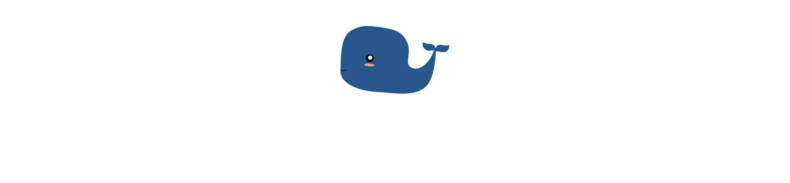

# Page d'Accueil Becode (en dév.)
  
## Les Consignes

Produire un parallax à partir du gabarit réalisé par [Marina Shvanova](https://github.com/marinasvn) pour le projet d'[Alixe Boumeridja](https://github.com/alixe82140).
  
## Contexte

Réalisé durant la formation [Becode](http://www.becode.org/).

## Code pour le Parallax sans Javascript

**HTML**

  

    
  

    

        
    

    

        
    

    

        
    

    

        
    

    

        
    

    

        
    

    

        

            

                

                    
                

                
Lorem blabla

            

        

    

**SCSS**

#main
{
    max-width: 1900px;
    .mainContainer
    {
      padding: 0 10px;
      .becodeDescription
      {
          .logoContainer
          {
              height: 25vh;
              .logo
              {
                  margin: 0 auto;
                  display: block;
                  max-width: 100%;
                  height: auto;
              }
            }
            .content
            {
                margin: 75px auto;
                max-width: 1140px;
                color: white;
                text-align: center;
                font-size: 2.2rem;
            }
        }
    }
}

.parallax
{
    perspective: 100px;
    perspective-origin: 50% 40%;
    height: 100vh;
    overflow-x: hidden;
    overflow-y: auto;
    position: absolute;
    top: 0;
    left: 0;
    right: 0;
    bottom: 0;

    .parallaxLayer
    {
        position: absolute;
        width: 100%;
        top: 0;
        right: 0;
        bottom: 0;
        left: 0;
        transition: all .5s;
    }

    .parallaxLayer
    {
        img
        {
            margin: 0 auto;
            display: block;
            position: absolute;
            width: 3000px;
            bottom: 0;
            left: 50%;
            margin-left: -1500px;
        }
    }

    .parallaxLayerCover
    {
        background: #16222e;
        display: block;
        position: absolute;
        min-height: 130vh;
        width: 100%;
        top: 70vh;
        left: 0;
        right: 0;
        z-index: 2;
    }

    .parallaxLayer1
    {
        transform-origin: 50% 50%;
        transform: translateZ(-300px) scale(4);
    }

    .parallaxLayer2
    {
        transform-origin: 50% 50%;
        transform: translateZ(-250px) scale(3.5);
    }

    .parallaxLayer3
    {
        transform-origin: 50% 50%;
        transform: translateZ(-200px) scale(3);
    }

    .parallaxLayer4
    {
        transform-origin: 50% 50%;
        transform: translateZ(-150px) scale(2.5);
    }

    .parallaxLayer5
    {
        transform-origin: 50% 50%;
        transform: translateZ(-50px) scale(1.5);
    }

    .parallaxLayer6
    {
        transform-origin: 50% 50%;
        transform: translateZ(-50px) scale(1.5);
    }

    .parallaxLayer7
    {
        transform-origin: 50% 50%;
        transform: translateZ(0px) scale(1);
    }
}
